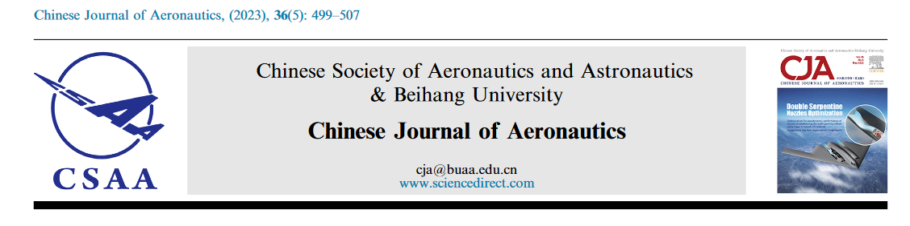

[A thermal activation based constitutive model for the dynamic deformation of AA5083 processed by large-scale equal-channel angular pressing](https://www.sciencedirect.com/science/article/pii/S1000936122001479)

*Yunfei WANG a,  Minjie WANG a,  Biao CHEN b,  Huijie SUN  a,  Katsuyoshi KONDOH  c,   Laszlo J.KECSKES  d,  Jianghua SHEN* * a e

### Abstract

Aluminum alloy 5083(AA5083) processed by large-scale Equal-channel angular pressing (ECAP) is an excellent engineering material with great prospects for  industrial applications. An accurate assessment of the underlying  constitutive relationships with easily determined material constants is  critical for the predictive design and informed processing of such  structural materials. To develop such a design framework, uniaxial  dynamic compressive testsover a wide range of temperatures (293–573 K) were carried out for an  ECAP-processed AA5083 alloy. Additionally, the microstructure before and after dynamic loading was characterized by SEM and TEM. Based on the  experimental results, a new dynamic constitutive model, based on thermal activation theory, was established to describe the plastic flow behavior of the AA5083 alloy that incorporates the effects of plastic  strain, temperature, and strain rate. The input parameters of the new  model were determined using a particle swarm optimization (PSO) method. The model predictions show excellent agreement with  experimental results, which suggests that the current predictive  constitutive model is highly effective in reproducing the dynamic deformation behavior of the large-scale ECAP-processed AA5083.

**[Full text](https://www.sciencedirect.com/science/article/pii/S1000936122001479)**

-------------------------

a: School of Aeronautics, Northwestern Polytechnical University, Xi’an 710072, China

b: School of Materials Science and Engineering, Northwestern Polytechnical University, Xi’an 710072, China

c: Joining and Welding Research Institute, Osaka University, 11-1 Mihogaoka, Osaka 567-0047, Japan

d: Hopkins Extreme Materials Institute, Johns Hopkins University, Baltimore 21218, USA

e: Shaanxi Key Laboratory of Impact Dynamic and Its Engineering Application, Xi’an 710072, China
